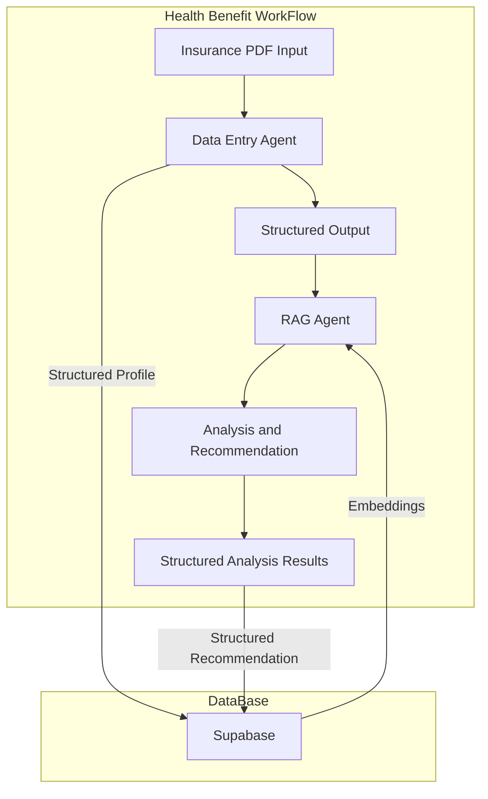

# Health AI Agent

This repository provides an advanced insurance benefits analysis system powered by AI, designed to help users maximize their mental health and paramedical coverage. The system extracts, analyzes, and provides actionable recommendations based on insurance documents, with support for PDF extraction, benefit tracking, and AI-driven insights.

## Project Overview

The workflow in `src/agent/graph.py` runs as a four-stage LangGraph pipeline that turns conversational plan details into tailored guidance:

1. **Data Entry Agent**
   - Collects raw insurance plan facts from the user conversation
   - Calls the `InsuranceProfile` tool to return a validated structured record

2. **Structured Profile Formatter**
   - Normalizes the tool-call response into the shared graph state
   - Preserves a clean insurance profile for downstream nodes

3. **RAG Agent**
   - Invokes the `rag` tool to gather external benefit insights from database
   - Produces an `AnalyzedProfile` with comparisons, coverage, and session estimates

4. **Insurance Review Responder**
   - Combines the structured profile and search output
   - Delivers recommendations on maximizing mental health and paramedical coverage

# System Architecture



### Component Details

1. **Data Entry Agent (`data_entry_agent`)**
   - ChatOpenAI model bound to the `InsuranceProfile` tool schema
   - Ensures plan information is captured with consistent field values

2. **Structured Profile Formatter (`structured_profile_response`)**
   - Extracts the tool-call arguments and writes the profile onto state
   - Keeps the conversation history aligned for later nodes

3. **RAG Agent (`rag_agent`)**
   - ChatOpenAI model configured with the `rag` tool
   - Emits structured benefit comparisons via the `AnalyzedProfile` schema

4. **Insurance Review Responder (`insurance_review_response`)**
   - Requests a natural-language summary that merges profile and search data
   - Returns the final recommendation payload to the user

## Component Description

1. **Input Layer**
   - User-provided insurance plan details captured through conversation
   - Environment variables (OpenAI credentials, search access)

2. **Core Components**
   - Data Entry Agent: Generates a structured `InsuranceProfile`
   - Structured Profile Formatter: Persists the profile for graph consumers
   - Web Search Agent: Enriches the profile with external comparisons
   - Insurance Review Responder: Crafts actionable guidance

3. **Data Models**
   - `InsuranceProfile`: Pydantic schema for member details and coverage amounts
   - `AnalyzedProfile`: Structured analysis returned from the search agent

4. **Output Layer**
   - Structured insurance profile with normalized fields
   - Search-informed benefit analysis and plan comparison notes
   - Final narrative on maximizing paramedical and mental health benefits

## Quick Start

1. **Setup Environment**
   ```bash
   # Clone repository
   git clone https://github.com/techbyfoundation/chioma-journal-ai.git
   cd chioma-journal-ai

   # Create Python environment with UV
   uv venv
   source .venv/bin/activate  # On Windows: .venv\Scripts\activate
   ```

2. **Install Dependencies**
   ```bash
   # Sync all dependencies
   uv sync

   ```

3. **Launch Services**
   ```bash
   # Start LangGraph development server
   uv run langgraph dev --no-browser
   ```

4. **Access Application**
   - Follow Command info for Agent Interface
 

## License

This project is licensed for InnerCompass

## Contact

